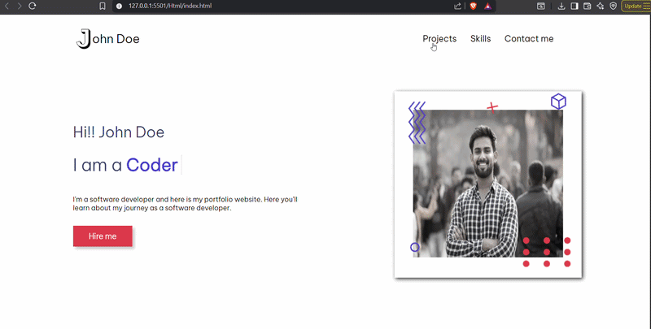

# John Doe — Developer Portfolio 🧑‍💻

A personal portfolio website built with HTML, CSS, and JavaScript to showcase projects, skills, and contact information.

---

## 📸 Demo



---

## 🚀 Features

- **Animated Hero Section** — Typed.js role animation + floating decorative icons
- **Projects Section** — Cards with hover effects, tech stack icons, GitHub & live links
- **Skills Section** — Tech stack logos with blob animation in the background
- **Contact Form** — Name, email, subject, and message fields
- **Footer** — Navigation links and social media icons

---

## 🛠️ Tech Used

- HTML5
- CSS3
- JavaScript
<<<<<<< HEAD
- [Typed.js](https://github.com/mattboldt/typed.js/) — role text animation
- [Font Awesome 6](https://fontawesome.com/) — icons
- [Google Fonts](https://fonts.google.com/) — Be Vietnam Pro

---

## 📁 Project Structure

```
├── index.html
├── CSS/
│   └── index.css
└── assets/
    ├── userasset/
    │   ├── letterj.jpg
    │   ├── newuser.jpg
    │   ├── blob vector.png
    │   ├── dots.png
    │   ├── cube.png
    │   ├── circle.png
    │   ├── zigzags.png
    │   └── plus.png
    ├── stack/
    │   └── (HTML, CSS, JS, React, Node, etc.)
    └── projects/
        ├── Project1.png
        ├── Project2.png
        ├── Project3.png
        └── Project4.png
```

## ⚙️ How It Works

- **Typed.js** cycles through roles (Full Stack Developer, UI-UX Designer, etc.) in the hero section.
- Project cards use CSS `::before` / `::after` pseudo-elements for the hover overlay effect.
- Decorative icons in the hero section use CSS `@keyframes` for independent floating animations.
- The blob in the skills section animates with a subtle drift using `@keyframes`.

---

## 🏃 How to Run

Open `index.html` directly in any browser. No build steps needed.

---

## 📌 Note

> This is a static front-end only project. The contact form does not submit data without a backend or form service (e.g. Formspree).
=======
- Typed.js (for typing animation)
- Font Awesome (for icons)
- Google Fonts

## How to Use

1. Clone or download this repository
2. Open `index.html` in your browser
3. Customize the content with your own information

## Project Structure
```
portfolio-website/
├── html/
│   └── index.html     # Main HTML file
├── CSS/
│   └── index.css      # Stylesheet
└── assets/
    ├── userasset/     # Profile images and decorative icons
    ├── stack/         # Technology icons
    └── projects/      # Project background images
```


Made with HTML, CSS & JavaScript

